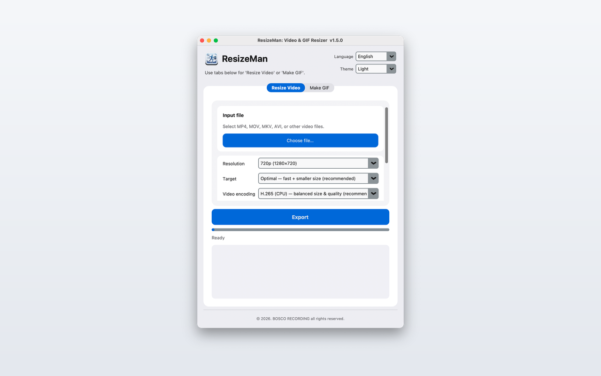
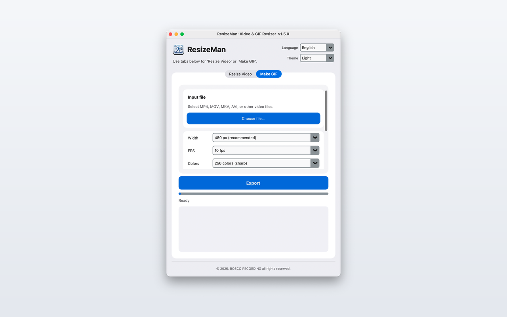

# ResizeMan: Video & GIF Resizer — Support

Public support page for **ResizeMan**, a Mac utility for local video resize/re-encode and GIF export.

> This repository is for **documentation and user support** (Issues).  
> Application source code is maintained separately and is not published here.

---

## About

**ResizeMan: Video & GIF Resizer** helps you change video resolution and codec, or export GIFs, **entirely on your Mac**.  
Selected files are processed locally with bundled FFmpeg. No account, cloud upload, analytics, or internet connection is required.

| Feature | Description |
|--------|-------------|
| **Resize Video** | MP4, MOV, MKV, AVI, and other common formats |
| **Make GIF** | Start time, duration, fps, colors, width |
| **GPU encoding** | Apple VideoToolbox on supported Macs (H.264 / H.265) |
| **Themes** | System, Light, Dark |
| **Languages** | Korean · English |

**Bundle ID:** `com.boscorecording.resizeman`  
**Developer:** BOSCO RECORDING (밤의 책장 스튜디오)

---

## Screenshots

### Resize Video | Make GIF

| Light · English | Light · English |
|:---:|:---:|
|  |  |

---

## Get help

| Channel | Link |
|---------|------|
| **Bug reports & questions** | [Open an Issue](https://github.com/boscorecording/ResizeMan-support/issues/new/choose) |
| **Email** | [boscorecording@gmail.com](mailto:boscorecording@gmail.com) |

When reporting a bug, please include:

- macOS version (e.g. macOS 14 Sonoma)
- App version (shown in the window title, e.g. v1.5.0)
- Mac model / chip (Intel or Apple Silicon)
- Input file format and approximate size
- Steps to reproduce and any log text from the app window

---

## Privacy

- Videos and GIFs are processed **only on your device**.
- We do **not** collect, upload, or sell user data.
- The app does not require sign-in.

---

## 한국어

**ResizeMan: Video & GIF Resizer**는 Mac에서 동영상 리사이즈·재인코딩과 GIF 추출을 로컬로 처리하는 유틸리티입니다.

| 기능 | 설명 |
|------|------|
| **비디오 리사이즈** | MP4, MOV, MKV 등 일반 포맷 |
| **GIF 만들기** | 구간, fps, 색 수, 너비 지정 |
| **GPU 가속** | VideoToolbox 지원 Mac에서 H.264/H.265 |
| **테마** | 시스템 / 라이트 / 다크 |
| **언어** | 한국어 · English |

**문의·버그 신고:** [Issues 등록](https://github.com/boscorecording/ResizeMan-support/issues/new/choose)  
**이메일:** boscorecording@gmail.com

버그 제보 시 macOS 버전, 앱 버전, Mac 기종(Apple Silicon/Intel), 입력 파일 형식, 재현 방법을 알려주시면 빠르게 확인할 수 있습니다.

### 스크린샷

위 **Screenshots** 섹션 참고 — 비디오 리사이즈·GIF 만들기, 라이트/다크 테마, 한국어·English UI.

---

## Related projects

| Project | Description |
|---------|-------------|
| [ResizeMan-support](https://github.com/boscorecording/ResizeMan-support) | This page — support & Issues |
| [ResizeMan_m](https://github.com/boscorecording/ResizeMan_m) | Future iOS / Android app (separate repo) |

---

## License

Documentation in this repository is provided under the [MIT License](LICENSE).  
ResizeMan application software is © BOSCO RECORDING. All rights reserved.
